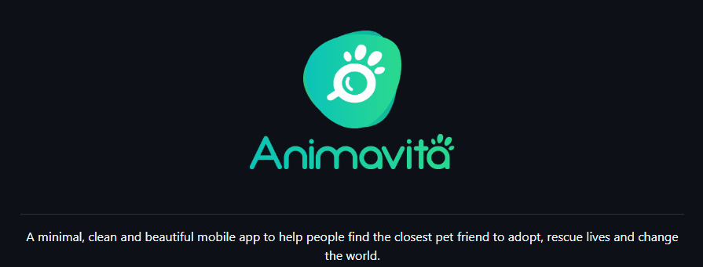

# Projeto com README
Um projeto de teste com um arquivo README🚀

[](https://github.com/animavita/animavita/blob/v2/README.md)

## Tecnologias utilizadas
- Markdown

## Como utilizar

### No Terminal

1- Clone o repositório
```
git clone https://github.com/matheusadir/repositorio-com-readme.git
```
2- Acesse a pasta do repositório
```
cd repositorio-com-readme/
```
3- Abre o README no Visual Studio Code
```
code .
```